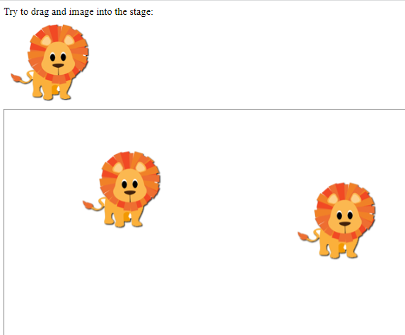

# React Konva

React Konva is a JavaScript library for drawing complex canvas graphics using [React](https://reactjs.org/)

# picture Demo

**How to drop image elements into a canvas with React?**
[Documentation](https://konvajs.org/docs/react/Drop_Image.html)